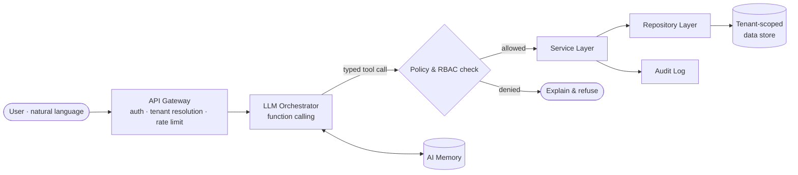

<!-- ───────────────────────────────  HEADER  ─────────────────────────────── -->
<div align="center">


<br/>

[](https://netjetlabs.com)
[](https://www.linkedin.com/in/istiaqahmednabil)
[](mailto:istiaqnabil@netjetlabs.com)


</div>

<br/>

<!-- ───────────────────────────────  ABOUT  ─────────────────────────────── -->

### `$ whoami`

```yaml
name:      Istiaq Ahmed Nabil
role:      Software Engineer — SaaS & enterprise systems
studio:    NetJet Labs  # independent engineering studio
studying:  B.Sc. Computer Science & Engineering
languages: [Bengali, English, Arabic]

builds:
  - multi-tenant SaaS platforms (ERP, school & business ops)
  - REST APIs and service-layer backends
  - AI-native interfaces driven by function calling
  - cross-platform apps (Flutter) and embedded/IoT devices

principles:
  - tenant isolation is a design decision, not a filter clause
  - secure by default: prepared statements, CSRF, rate limiting, session hardening
  - targeted, well-reasoned changes over big-bang rewrites
  - ship to production, then measure and iterate
```

I'm an engineer first. Through **NetJet Labs** I design and ship production software for schools, institutions, and growing businesses — taking ideas from data model to deployed product, and increasingly putting an AI layer between people and the systems they run.

<br/>

<!-- ───────────────────────────────  PROJECTS  ─────────────────────────────── -->

### `$ ls ./projects`

<table>
<tr>
<td width="50%" valign="top">

#### ⬢ NetJet ERP
<sub><code>SaaS</code> · <code>Multi-tenant</code> · <code>REST</code></sub>

A modular ERP platform for institutions and businesses, built around a shared core with tenant-scoped modules.

`SIS` `HRM` `Payroll` `Finance & Accounting` `Attendance` `Inventory` `CRM` `RBAC` `REST API`

</td>
<td width="50%" valign="top">

#### ⬢ NetJet AI OS
<sub><code>R&D</code> · <code>LLM</code> · <code>Function calling</code></sub>

An AI-first business operating system — users state intent in natural language instead of navigating ERP menus; the model calls typed, permission-checked business functions.

`Function Calling` `Service Layer` `Repository Pattern` `Multi-Tenancy` `AI Memory` `Secure Automation`

</td>
</tr>
<tr>
<td width="50%" valign="top">

#### ⬢ SalafiaX
<sub><code>Production</code> · <code>Flutter</code> · <code>PHP API</code> · <code>Google Play</code></sub>

A school management app for students and teachers, live on Google Play and in daily use.

`Student & Teacher Portals` `Attendance` `Results` `Notices` `Holidays` `Fee Alerts` `Routines` `Push Notifications`

</td>
<td width="50%" valign="top">

#### ⬢ Embedded & IoT
<sub><code>ESP32</code> · <code>Arduino</code> · <code>RFID</code></sub>

Hardware that feeds software — RFID-based identity and attendance, sensor nodes, and device-to-API integrations.

`ESP32` `Arduino` `RFID` `IoT → REST`

</td>
</tr>
</table>

<br/>

<!-- ───────────────────────────────  ARCHITECTURE  ─────────────────────────────── -->

### `$ cat ai-os/architecture.md`

How NetJet AI OS turns a sentence into a safe business action:



<br/>

<!-- ───────────────────────────────  STACK  ─────────────────────────────── -->

### `$ stack --list`

<table>
<tr><td><b>Languages</b></td><td>


</td></tr>
<tr><td><b>Backend & Data</b></td><td>


</td></tr>
<tr><td><b>Mobile</b></td><td>


</td></tr>
<tr><td><b>AI</b></td><td>


</td></tr>
<tr><td><b>Infra & Tooling</b></td><td>


</td></tr>
<tr><td><b>Embedded</b></td><td>


</td></tr>
</table>

<br/>

<!-- ───────────────────────────────  NOW  ─────────────────────────────── -->

### `$ git log --since="this quarter" --oneline`

```diff
+ researching  LLM function calling & agentic workflows for business ops
+ designing    tenant isolation strategies for multi-tenant SaaS
+ learning     distributed systems · cloud infrastructure · DevOps
+ learning     advanced software architecture at SaaS scale
+ shipping     new features to SalafiaX in production
```

<details>
<summary><b>Areas of interest</b></summary>
<br/>

Artificial Intelligence · SaaS Architecture · Distributed Systems · Enterprise Software · Cyber Security · Computer Vision · NLP · Robotics & Embedded Systems · Space Technology · Open Source

</details>

<br/>

<!-- ───────────────────────────────  STATS  ─────────────────────────────── -->

### `$ gh stats`

<div align="center">


</div>

<br/>

<!-- ───────────────────────────────  FOOTER  ─────────────────────────────── -->

<div align="center">

**Building software that survives contact with production.**

<sub>Open to remote software engineering roles · Collaborations welcome via <a href="mailto:istiaqnabil@netjetlabs.com">email</a></sub>

<br/><br/>


</div>
